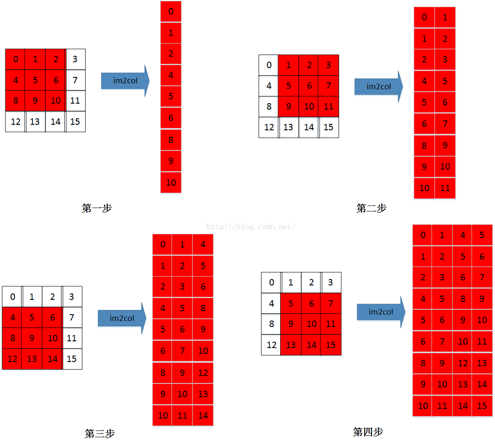

# Learn-Deep-Learning
deep learning 学习总结

## Verification_Code_Recognize

简单的 3+1 的CNN网络来训练识别验证码，适合**深度学习入门**；

可以学到：

* 数据输入(placeholder)
* 网络构建
* 模型保存
* 模型加载

## cifar-10

2+2 的CNN网络来训练 cifar-10，适合**深度学习进阶**

可以学到：

* 数据输入(tf.train.string_input_producer)
* tensorboard可视化
* 多 GPU 训练
* 动态学习率
* 多线程
* 权重衰减

## Transfer_Learning
使用预训练的Ｉnception模型来识别花卉种类

可以学到：

* **迁移学习**
* 模型加载

## tensorflow 预训练模型

Model | TF-Slim File | Checkpoint | Top-1 Accuracy| Top-5 Accuracy |
:----:|:------------:|:----------:|:-------:|:--------:|
[Inception V1](http://arxiv.org/abs/1409.4842v1)|[Code](https://github.com/tensorflow/models/blob/master/research/slim/nets/inception_v1.py)|[inception_v1_2016_08_28.tar.gz](http://download.tensorflow.org/models/inception_v1_2016_08_28.tar.gz)|69.8|89.6|
[Inception V2](http://arxiv.org/abs/1502.03167)|[Code](https://github.com/tensorflow/models/blob/master/research/slim/nets/inception_v2.py)|[inception_v2_2016_08_28.tar.gz](http://download.tensorflow.org/models/inception_v2_2016_08_28.tar.gz)|73.9|91.8|
[Inception V3](http://arxiv.org/abs/1512.00567)|[Code](https://github.com/tensorflow/models/blob/master/research/slim/nets/inception_v3.py)|[inception_v3_2016_08_28.tar.gz](http://download.tensorflow.org/models/inception_v3_2016_08_28.tar.gz)|78.0|93.9|
[Inception V4](http://arxiv.org/abs/1602.07261)|[Code](https://github.com/tensorflow/models/blob/master/research/slim/nets/inception_v4.py)|[inception_v4_2016_09_09.tar.gz](http://download.tensorflow.org/models/inception_v4_2016_09_09.tar.gz)|80.2|95.2|
[Inception-ResNet-v2](http://arxiv.org/abs/1602.07261)|[Code](https://github.com/tensorflow/models/blob/master/research/slim/nets/inception_resnet_v2.py)|[inception_resnet_v2_2016_08_30.tar.gz](http://download.tensorflow.org/models/inception_resnet_v2_2016_08_30.tar.gz)|80.4|95.3|
[ResNet V1 50](https://arxiv.org/abs/1512.03385)|[Code](https://github.com/tensorflow/models/blob/master/research/slim/nets/resnet_v1.py)|[resnet_v1_50_2016_08_28.tar.gz](http://download.tensorflow.org/models/resnet_v1_50_2016_08_28.tar.gz)|75.2|92.2|
[ResNet V1 101](https://arxiv.org/abs/1512.03385)|[Code](https://github.com/tensorflow/models/blob/master/research/slim/nets/resnet_v1.py)|[resnet_v1_101_2016_08_28.tar.gz](http://download.tensorflow.org/models/resnet_v1_101_2016_08_28.tar.gz)|76.4|92.9|
[ResNet V1 152](https://arxiv.org/abs/1512.03385)|[Code](https://github.com/tensorflow/models/blob/master/research/slim/nets/resnet_v1.py)|[resnet_v1_152_2016_08_28.tar.gz](http://download.tensorflow.org/models/resnet_v1_152_2016_08_28.tar.gz)|76.8|93.2|
[ResNet V2 50](https://arxiv.org/abs/1603.05027)^|[Code](https://github.com/tensorflow/models/blob/master/research/slim/nets/resnet_v2.py)|[resnet_v2_50_2017_04_14.tar.gz](http://download.tensorflow.org/models/resnet_v2_50_2017_04_14.tar.gz)|75.6|92.8|
[ResNet V2 101](https://arxiv.org/abs/1603.05027)^|[Code](https://github.com/tensorflow/models/blob/master/research/slim/nets/resnet_v2.py)|[resnet_v2_101_2017_04_14.tar.gz](http://download.tensorflow.org/models/resnet_v2_101_2017_04_14.tar.gz)|77.0|93.7|
[ResNet V2 152](https://arxiv.org/abs/1603.05027)^|[Code](https://github.com/tensorflow/models/blob/master/research/slim/nets/resnet_v2.py)|[resnet_v2_152_2017_04_14.tar.gz](http://download.tensorflow.org/models/resnet_v2_152_2017_04_14.tar.gz)|77.8|94.1|
[ResNet V2 200](https://arxiv.org/abs/1603.05027)|[Code](https://github.com/tensorflow/models/blob/master/research/slim/nets/resnet_v2.py)|[TBA]()|79.9\*|95.2\*|
[VGG 16](http://arxiv.org/abs/1409.1556.pdf)|[Code](https://github.com/tensorflow/models/blob/master/research/slim/nets/vgg.py)|[vgg_16_2016_08_28.tar.gz](http://download.tensorflow.org/models/vgg_16_2016_08_28.tar.gz)|71.5|89.8|
[VGG 19](http://arxiv.org/abs/1409.1556.pdf)|[Code](https://github.com/tensorflow/models/blob/master/research/slim/nets/vgg.py)|[vgg_19_2016_08_28.tar.gz](http://download.tensorflow.org/models/vgg_19_2016_08_28.tar.gz)|71.1|89.8|
[MobileNet_v1_1.0_224](https://arxiv.org/pdf/1704.04861.pdf)|[Code](https://github.com/tensorflow/models/blob/master/research/slim/nets/mobilenet_v1.py)|[mobilenet_v1_1.0_224.tgz](http://download.tensorflow.org/models/mobilenet_v1_2018_02_22/mobilenet_v1_1.0_224.tgz)|70.9|89.9|
[MobileNet_v1_0.50_160](https://arxiv.org/pdf/1704.04861.pdf)|[Code](https://github.com/tensorflow/models/blob/master/research/slim/nets/mobilenet_v1.py)|[mobilenet_v1_0.50_160.tgz](http://download.tensorflow.org/models/mobilenet_v1_2018_02_22/mobilenet_v1_0.5_160.tgz)|59.1|81.9|
[MobileNet_v1_0.25_128](https://arxiv.org/pdf/1704.04861.pdf)|[Code](https://github.com/tensorflow/models/blob/master/research/slim/nets/mobilenet_v1.py)|[mobilenet_v1_0.25_128.tgz](http://download.tensorflow.org/models/mobilenet_v1_2018_02_22/mobilenet_v1_0.25_128.tgz)|41.5|66.3|
[MobileNet_v2_1.4_224^*](https://arxiv.org/abs/1801.04381)|[Code](https://github.com/tensorflow/models/blob/master/research/slim/nets/mobilenet/mobilenet_v2.py)| [mobilenet_v2_1.4_224.tgz](https://storage.googleapis.com/mobilenet_v2/checkpoints/mobilenet_v2_1.4_224.tgz) | 74.9 | 92.5|
[MobileNet_v2_1.0_224^*](https://arxiv.org/abs/1801.04381)|[Code](https://github.com/tensorflow/models/blob/master/research/slim/nets/mobilenet/mobilenet_v2.py)| [mobilenet_v2_1.0_224.tgz](https://storage.googleapis.com/mobilenet_v2/checkpoints/mobilenet_v2_1.0_224.tgz) | 71.9 | 91.0
[NASNet-A_Mobile_224](https://arxiv.org/abs/1707.07012)#|[Code](https://github.com/tensorflow/models/blob/master/research/slim/nets/nasnet/nasnet.py)|[nasnet-a_mobile_04_10_2017.tar.gz](https://storage.googleapis.com/download.tensorflow.org/models/nasnet-a_mobile_04_10_2017.tar.gz)|74.0|91.6|
[NASNet-A_Large_331](https://arxiv.org/abs/1707.07012)#|[Code](https://github.com/tensorflow/models/blob/master/research/slim/nets/nasnet/nasnet.py)|[nasnet-a_large_04_10_2017.tar.gz](https://storage.googleapis.com/download.tensorflow.org/models/nasnet-a_large_04_10_2017.tar.gz)|82.7|96.2|
[PNASNet-5_Large_331](https://arxiv.org/abs/1712.00559)|[Code](https://github.com/tensorflow/models/blob/master/research/slim/nets/nasnet/pnasnet.py)|[pnasnet-5_large_2017_12_13.tar.gz](https://storage.googleapis.com/download.tensorflow.org/models/pnasnet-5_large_2017_12_13.tar.gz)|82.9|96.2|
[PNASNet-5_Mobile_224](https://arxiv.org/abs/1712.00559)|[Code](https://github.com/tensorflow/models/blob/master/research/slim/nets/nasnet/pnasnet.py)|[pnasnet-5_mobile_2017_12_13.tar.gz](https://storage.googleapis.com/download.tensorflow.org/models/pnasnet-5_mobile_2017_12_13.tar.gz)|74.2|91.9|

## 关于卷积矩阵计算时im2col简介
[CSDN](https://blog.csdn.net/dwyane12138/article/details/78449898)

## CNN网络参数计算方法
以 LeNet-5 网络为例：[CSDN](https://blog.csdn.net/dcxhun3/article/details/46878999)
