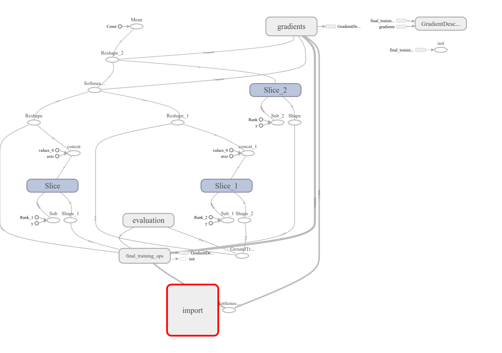
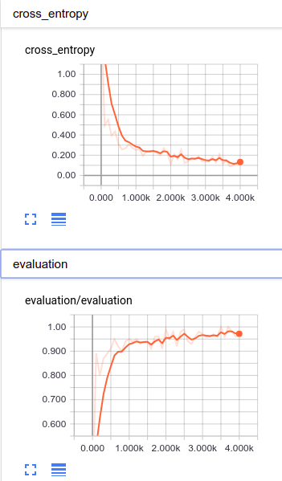
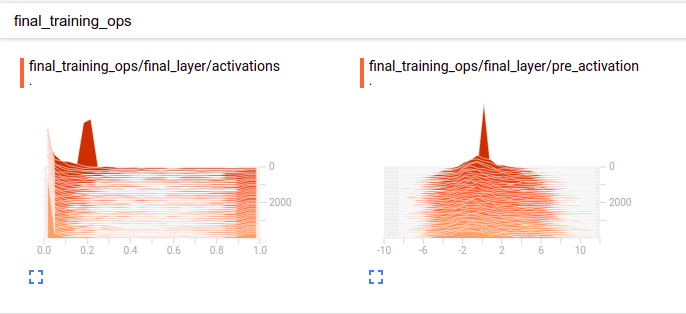

# 迁移学习--Inception模型的花卉种类识别

## 文件结构
```
-transfer_learning
	-flower_photos	//花卉图片
		-daisy		
		-dandelion		
		-roses		
		-sunflowers		
		-tulips		
	-model
		-tensorflow_inception_graph.pb   //模型文件
		-imagenet_comp_graph_label_strings.txt
	-bottleneck   //保存模型瓶颈层的特征结果
		-daisy		//daisy类花特征保存在txt中
		-dandelion
		-roses
		-sunflowers
		-tulips
	-log	//存放用于tensorboard可视化的events信息
	-flower_recognize.py
```

## Code
* 先将图片过一遍inception-v3,　得到BOTTLENECK_TENSOR_NAME的权重，然后自己在加了一个分类的全连接层，
定义了损失函数与优化方法，得到最终的分类输出；

* bottleneck_values = sess.run(bottleneck_tensor, {image_data_tensor: image_data})

  将图像过一遍inception-v3，得到图片的 feature map;
 
* gfile.FastGFile(image_path, 'rb').read()

　读取图像，可以直接处理成tensorflow需要的张量形式，如果使用opencv等读取，还需要转化成tensorflow内部的张量形式；

## tensorboard
* writer = tf.summary.FileWriter(log_dir, tf.get_default_graph())
   
   保存计算图，同时也提供写入其他日志文件的writer.add_summary(), 放在　with tf.Session() as sess:的下面
  
   
   
*  tf.summary.scalar('cross_entropy', cross_entropy_mean)

　　折线图，放在定义该变量位置的下面，一般**交叉熵损失，准确率**等都使用该函数
  
  　
  
* tf.summary.histogram('final_layer' + '/pre_activation', logits)
　　
    将张量保存为直方图，可以查看张量数据随着迭代轮数变化的趋势，放在定义该张量位置的下面，
    一般查看**权重w，偏置b和特征张量y**的时候使用；
    
    
    
*　tf.summary.image('bottleneck', bottleneck_values, 9)

    可视化张量，放在想要查看的张量下面，要先使用tf.reshape(x, [-1, 28, 28, 1])将张量变为
    张量变为四维，第一个参数是命名，最后一个参数为要查看的图像最大数量；
    
* merged = tf.summary.merge_all()

  整理所有的张量，放在with tf.Session() as sess:的上一行，在run训练时一起run，
  例如，_, summary = sess.run([train_step, merged], feed_dict={bottleneck_input: train_bottlenecks, ground_truth_input: train_ground_truth})，然后在for i in range(STEPS):　时要执行写操作　writer.add_summary(summary, i)，使其每隔n步写入一次数据；
  
* writer.close() 
    写在sess会话外
  
## DRAWBACKS:
* 每次运行都要重新划分整理数据集，所需时间过长
* 网络能够很快收敛，但无法达到很高的正确率

## ENVS
python == 2.7

tensorflow == 1.2.1

## OTHERS
数据集下载地址：[flower_photos.tgz](http://download.tensorflow.org/example_images/flower_photos.tgz)

模型文件下载地址：[inception_dec_2015.zip](https://storage.googleapis.com/download.tensorflow.org/models/inception_dec_2015.zip) (需要翻墙)

知乎lqfarmer写的上关于迁移学习的[综述](https://zhuanlan.zhihu.com/p/27368456)(引用不正规，如有侵权，请联系删除！)
